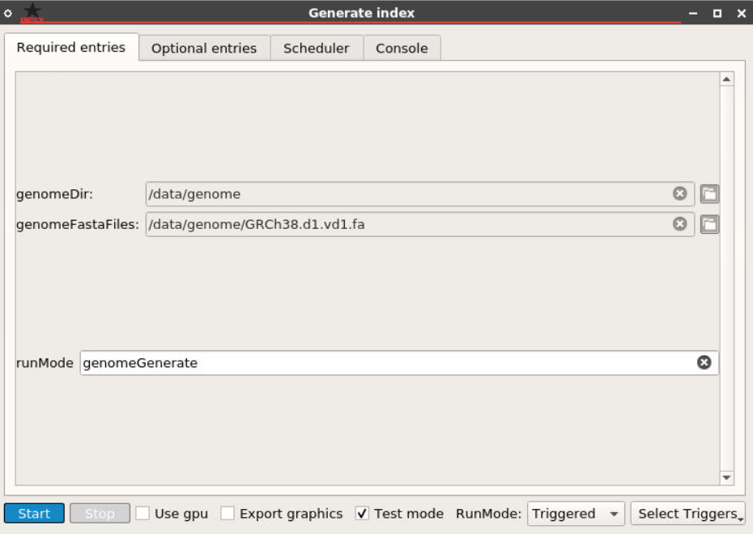

# GDC RNA-Seq dr15plus Pipeline

## Implemented with the BioDepot-workflow-builder (Bwb)

# Table of Contents

- [GDC RNA-Seq dr15plus Pipeline](#gdc-rna-seq-dr15plus-pipeline)
  - [Implemented with the BioDepot-workflow-builder (Bwb)](#implemented-with-the-biodepot-workflow-builder-bwb)
- [Table of Contents](#table-of-contents)
- [Overview](#overview)
  - [Workflow in the demo state](#workflow-in-the-demo-state)
  - [Start workflow](#start-workflow)
  - [Download](#download)
  - [Index reference](#index-reference)
  - [Quantify mRNA](#quantify-mrna)
    - [Star Align](#star-align)
    - [Sort BAM](#sort-bam)
    - [Index BAM](#index-bam)
    - [Gene counts](#gene-counts)
    - [Normalize counts](#normalize-counts)
    - [Display counts](#display-counts)
  - [Gene fusions](#gene-fusions)
- [Appendix](#appendix)
  - [Common issues with workflows](#common-issues-with-workflows)
  - [Software and hardware specifications](#software-and-hardware-specifications)

# Overview

The RNA-Seq Workflow is based off of the Genomic Data Commons documentation located here: [https://docs.gdc.cancer.gov/Data/Bioinformatics_Pipelines/Expression_mRNA_Pipeline/](https://docs.gdc.cancer.gov/Data/Bioinformatics_Pipelines/Expression_mRNA_Pipeline/)

This version of the RNA-Seq Workflow follows the specifications listed in the Genomic Data Commons Dr15plus version of the pipeline, using v22 annotation GTF file rather than v32. Settings for **STAR (version 2.6.0c)** are different from the settings from version 32 of the workflow, and more tools are used to generate counts from STAR's BAM file outputs:

* Samtools: Sort BAM files, then index BAM files
* HTSeq: Generate counts from sorted BAM files

## Workflow in the demo state

The workflow contains public-accessible genome and sample files, so no token is required to run the workflow.

Begin the workflow by clicking the Start button from the Start widget.

## Start workflow

The start widget predefines some of the inputs needed in the subsequent widgets to run the workflow. Work and genome directories can be modified to set where output files and genome files are located.

Genome reference, annotation, and gene information files are downloaded from the download widget, but can be changed to any set of genome files if already present.

## Download

Two download widgets are used to download small FASTQ samples from the Broad Institute found [here](https://data.broadinstitute.org/Trinity/CTAT_FUSIONTRANS_BENCHMARKING/on_cancer_cell_lines/reads), and genome files the GDC's reference files found [here](https://gdc.cancer.gov/about-data/gdc-data-processing/gdc-reference-files). All alignments are performed using the human reference genome GRCh38.d1.vd1.

## Index reference

STAR is used to generate the index using the genome reference files downloaded from GDC. Settings follow the Dr15Plus version of the pipeline, except for "runThreadN", which is set to execute the widget using 16 threads. This value can be dropped to use less threads if needed.

## Quantify mRNA

Multiple widgets are used for quantization of FASTQ files into FPKM normalized counts.

### Star Align

After generating the index from STAR, the next step is to align the FASTQ files into BAM files mapped to the reference. Settings follow the Dr15Plus version of the pipeline, except for "runThreadN", which is set to execute the widget using 16 threads. This value can be dropped to use less threads if needed. If other FASTQ files want to be used in the aligner, paste the path to the files in the **readFilesIn** entry, then select **Multiple samples** and either **Alternating paired-end files** or **Sequential paired-end files** in the optional entries, depending on how the files in readFileIn are ordered.

Outputs from Star Align can be found in the work directory, with the BAM file output being called Aligned.out.bam by default for each sample.

### Sort BAM

Samtools is used to sort the BAM file.

### Index BAM

Samtools is used to index the BAM file.

### Gene counts

HTSeq is used to generate the counts from the BAM file after sorting and indexing using the gtf file (downloaded and provided by the GDC reference, version 22). Output is currently set to "Aligned_sorted.counts" file in the work directory.

### Normalize counts

FPKM method, explained in the GDC pipeline documentation, is used to normalized the counts from HTSeq.

### Display counts

Normalized counts are displayed in using Gnumeric.

## Gene fusions

Arriba Fusion (v1.1.0) and STAR-Fusion (v1.6) pipelines are used at the end of the workflow to detect gene fusions and generate gene fusion data (chimeric junction), respectively. Descriptions of each pipeline are described in the GDC pipeline documentation.

# Appendix

## Common issues with workflows

One of the biggest issues with the GDC workflow is that several tools have changed throughout the course of their life cycles. Often major revisions of tools will come with option changes. Certain options may be deprecated or deleted entirely. Sometimes option flags will be renamed or inputs will need to be passed in a different way. All of these things sound very minor but turn what could be a straightforward workflow into a several hour debugging session. The point is to use care when updating tool versions or widgets.

## Software and hardware specifications

The workflow was tested on an AWS Elastic Cloud Compute (EC2)  instance with the following specifications:

| Option | Value|
| - | - |
| Instance Type | r5d.2xlarge
| Distribution | Ubuntu server 20.04
| Disk space | 200GB
| Memory | 64GB
| vCPU | 8

The workflow was tested with version 1.0 of Bwb ([https://github.com/BioDepot/BioDepot-workflow-builder/releases/tag/v1.0,0](https://github.com/BioDepot/BioDepot-workflow-builder/releases/tag/v1.0,0))
