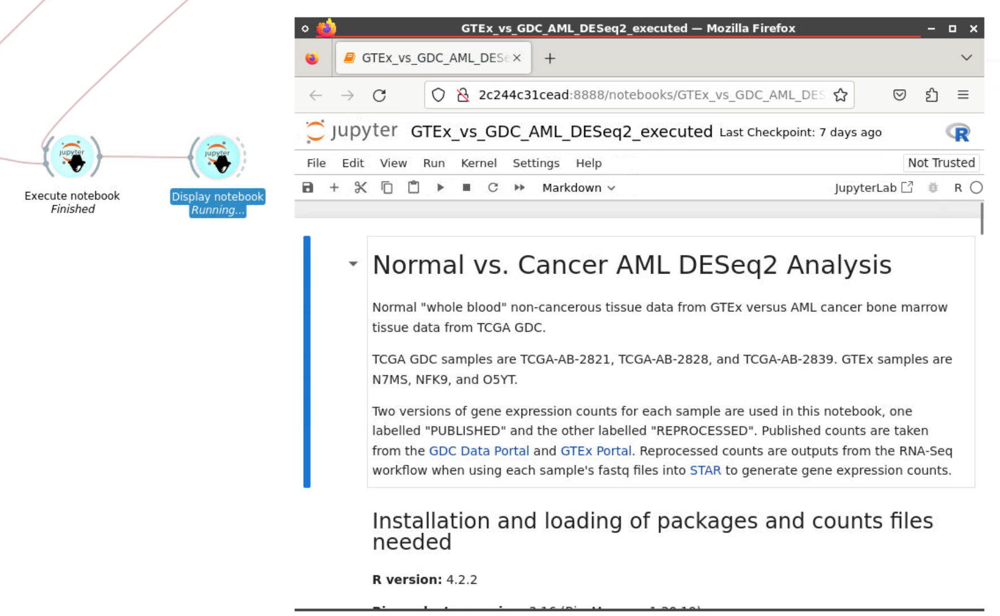

# GDC RNA-Seq dr32 BAM CRDC Pipeline

## Implemented with the BioDepot-workflow-builder (Bwb)

## Table of Contents

- [GDC RNA-Seq dr32 BAM CRDC Pipeline](#gdc-rna-seq-dr32-bam-crdc-pipeline)
  - [Implemented with the BioDepot-workflow-builder (Bwb)](#implemented-with-the-biodepot-workflow-builder-bwb)
  - [Table of Contents](#table-of-contents)
  - [Overview](#overview)
  - [Workflow in the demo state](#workflow-in-the-demo-state)
  - [Start workflow](#start-workflow)
  - [Download](#download)
  - [Convert BAM to FASTQ](#convert-bam-to-fastq)
  - [Index reference](#index-reference)
  - [Quantify mRNA (and analysis)](#quantify-mrna-and-analysis)
    - [Star Align](#star-align)
    - [Jupyter Notebook](#jupyter-notebook)
- [Appendix](#appendix)
  - [Common issues with workflows](#common-issues-with-workflows)
  - [Software and hardware specifications](#software-and-hardware-specifications)

## Overview

The RNA-Seq Workflow is based off of the Genomic Data Commons documentation located here: [https://docs.gdc.cancer.gov/Data/Bioinformatics_Pipelines/Expression_mRNA_Pipeline/](https://docs.gdc.cancer.gov/Data/Bioinformatics_Pipelines/Expression_mRNA_Pipeline/)

This version of the RNA-Seq Workflow follows the specifications listed in the Genomic Data Commons version 32 of the pipeline, using **annotation v36 GTF file and STAR (version 2.7.5c)** for index and alignment. Six samples from GDC and GTEx (three from each source) are downloaded and processed using STAR, and differential expression analysis is done using Jupyter Notebooks. Normal "whole blood" non-cancerous tissue data from GTEx versus AML cancer bone marrow tissue data from TCGA GDC.The notebook is executed as widgets at the end of the workflow, and the output can be seen both inside Bwb and in the Github located [here](/GDC%20vs%20GTEx%20compare/work/GTEx_vs_GDC_AML_DESeq2.ipynb).

## Workflow in the demo state

The workflow contains PRIVATE-accessible genome and sample files

Begin the workflow by clicking the Start button from the Start widget.

## Start workflow

The start widget predefines some of the inputs needed in the subsequent widgets to run the workflow. Work and genome directories can be modified to set where output files and genome files are located.

Genome reference, annotation, and gene information files are downloaded from the download widget, but can be changed to any set of genome files if already present.

Additional inputs are required for both GDC and GTEx sample UUIDs to download in the downstream steps. GDC access [credentials](https://nci-crdc.datacommons.io/login) and [token](https://portal.gdc.cancer.gov/), and GTEx access [credentials](https://gen3.theanvil.io/login), are needed to download these samples using GEN3, which the files are loaded in the ptional entries section of the start widget.

## Download

Four different download widgets are used to download BAM files for the 3 GDC and 3 GTEx samples, genome files, and the additional files for differential expression analysis (the Jupyter Notebook itself and provided counts from GDC and GTEx). All alignments are performed using the human reference genome GRCh38.d1.vd1. BAM files are downloaded via GEN3

## Convert BAM to FASTQ

Conversions of the downloaded BAM files for both GDC and GTEx samples and FASTQ are completed before running STAR. GDC and GTEx get their own conversion method based on their respective pipeline setup. GDC uses Biobambam2, and GTEx uses SamToFastq.

## Index reference

STAR is used to generate the index using the genome reference files downloaded from GDC. Settings follow the v32 version of the pipeline, except for "runThreadN", which is set to execute the widget using 16 threads. This value can be dropped to use less threads if needed.

## Quantify mRNA (and analysis)

Multiple widgets are used for quantization of the GDC and GTEx sample FASTQ files, as well as differential expression analysis.

### Star Align

After generating the index from STAR, the next step is to align the FASTQ files into BAM files mapped to the reference. Settings follow the v32 version of the pipeline, except for "runThreadN", which is set to execute the widget using 16 threads.

Outputs from Star Align can be found in the work directory, with the BAM file output being called Aligned.out.bam by default for each sample. However, this version of the workflow has the raw counts generated by STAR directly, with the file output for counts are called **ReadsPerGene.out.tab** found in the work directory.

### Jupyter Notebook

Differential expression and other analyses between the GDC and GTEx sample counts is done with Jupyter Notebooks. There are two widgets at the end of the workflow, one is to execute all cells in the Jupyter Notebooks (downloaded earlier) that compares the counts obtained in the workflow, as well as counts provided by GDC and GTEx for their respective samples. The notebook after execution is saved. The second widget is to display the previously-executed notebook onto the Bwb screen via Firefox. The output notebook should be the same notebook seen in the [GTEx vs GDC Jupyter Notebook](/GDC%20vs%20GTEx%20compare/work/GTEx_vs_GDC_AML_DESeq2.ipynb) in this GitHub.

# Appendix

## Common issues with workflows

One of the biggest issues with the GDC workflow is that several tools have changed throughout the course of their life cycles. Often major revisions of tools will come with option changes. Certain options may be deprecated or deleted entirely. Sometimes option flags will be renamed or inputs will need to be passed in a different way. All of these things sound very minor but turn what could be a straightforward workflow into a several hour debugging session. The point is to use care when updating tool versions or widgets.

## Software and hardware specifications

The workflow was tested on an AWS Elastic Cloud Compute (EC2)  instance with the following specifications:

| Option | Value|
| - | - |
| Instance Type | r5d.2xlarge
| Distribution | Ubuntu server 20.04
| Disk space | 200GB
| Memory | 64GB
| vCPU | 8

The workflow was tested with version 1.0 of Bwb ([https://github.com/BioDepot/BioDepot-workflow-builder/releases/tag/v1.0,0](https://github.com/BioDepot/BioDepot-workflow-builder/releases/tag/v1.0,0))
