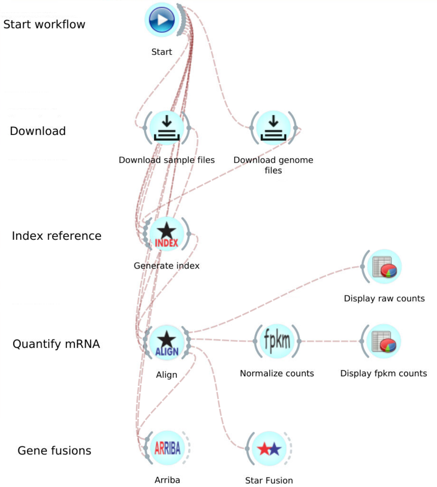

# GDC RNA-Seq dr32 Pipeline

## Implemented with the BioDepot-workflow-builder (Bwb)

# Table of Contents

- [GDC RNA-Seq dr32 Pipeline](#gdc-rna-seq-dr32-pipeline)
  - [Implemented with the BioDepot-workflow-builder (Bwb)](#implemented-with-the-biodepot-workflow-builder-bwb)
- [Table of Contents](#table-of-contents)
- [Overview](#overview)

# Overview

This workflow is _identical_ to the **GDC_mRNA_multi_dr32_fpkm** workflow, but using downsampled FASTQ and genome files isolated to chromosome 22. These files are already downsampled, so no extra step of downsampling is needed in the workflow. The purpose is to execute the workflow within minutes after starting the Start widget.

No changes are made to each of the widgets outside of the downsampled input files.
 For more information about the widgets in the workflow, refer to the [GDC_mRNA_multi_dr32_fpkm workflow documentation readme](../GDC_mRNA_multi_dr32_fpkm/).
